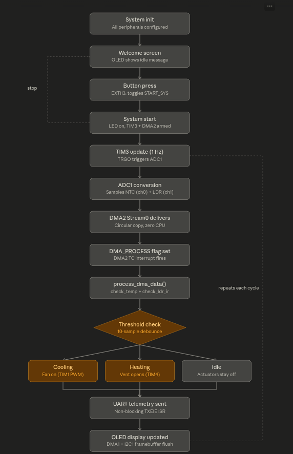

# 🧊 DMA-Driven Environmental Monitoring & Control Platform
### Register-Level STM32 Firmware for Enclosure Climate Control


A closed-loop climate monitoring and control system built entirely at the register level on an STM32F446RE — no HAL, no CubeMX-generated drivers. Nine peripherals (DMA ×2, ADC, four timers, I2C, USART, GPIO/EXTI) are configured and coordinated by hand to keep the control loop non-blocking end to end: sensor acquisition, actuator response, telemetry, and display all run without the CPU stalling in a wait loop for any of them.

---

## What it does

- Continuously samples an NTC thermistor and an LDR via ADC, moved into memory by DMA with zero CPU involvement per sample.
- Runs a debounced threshold controller: when temperature rises above the configured high threshold, a fan spins up; when it falls below the configured low threshold, a servo-actuated vent opens. Both use a consecutive-reading counter (10 in-range or out-of-range DMA cycles) before switching state, so a single noisy ADC sample can't flip an actuator.
- Detects proximity/light state via an IR proximity pin and the LDR reading, to flag door-open/closed state.
- Logs every cycle (count, temperature, LDR, door, fan, vent, raw ADC) over UART at 115200 baud, non-blocking via a TXE-interrupt-driven send state machine.
- Displays live status on an SSD1306 OLED, updated over I2C using a hybrid CPU/DMA transfer — see the write-up below on getting this actually working.
- Starts/stops the whole system on a button press (EXTI13), returning to a clean idle state each time.

---

## Peripheral map

| Peripheral | Role |
|---|---|
| **ADC1** | 12-bit scan mode, channels 0 (NTC) and 1 (LDR), triggered externally |
| **DMA2 Stream 0** | Circular, ADC1 → `buffer[]`, fires `DMA_PROCESS` flag on transfer-complete |
| **DMA1 Stream 6** | Memory → I2C1->DR, pushes the 1025-byte OLED framebuffer with no per-byte CPU involvement |
| **TIM3** | Master timebase — TRGO on update drives ADC1 conversions (~1 Hz) |
| **TIM4 (CH3, PB8)** | 50 Hz servo PWM for the vent actuator; a `TIM4_IRQHandler` ramps `CCR3` toward a target in small steps each update, for smooth (non-instant) servo motion |
| **TIM1 (CH2, PA9)** | Fan motor PWM |
| **TIM2 (CH1, PA5)** | Status-LED blink while cooling/heating is active |
| **I2C1 (PB6/PB7)** | SSD1306 OLED display driver |
| **USART2 (PA2)** | Interrupt-driven telemetry logging |
| **EXTI13 (PC13)** | Start/stop button, falling-edge triggered |

PWM frequencies are derived from each timer's PSC/ARR against the configured timer clock (not included in the files shared here) — the servo timer's 50 Hz is a standard-servo-safe value; verify the fan and LED-blink timer frequencies against your actual APB clock if you rely on a specific switching frequency.

---

## Control logic

The controller is a **debounced double-threshold state machine**, not a naive single-sample compare:

```
temp > optimum_temp_high, sustained for 10 consecutive DMA cycles
    → COOLING_PROCESS: fan ON, status LED blinks

temp < optimum_temp_low, sustained for 10 consecutive DMA cycles
    → HEATING_PROCESS: vent servo opens, status LED blinks

temp back in range, sustained for 10 consecutive DMA cycles
    → whichever process is active is stopped, actuator returns to idle
```

`optimum_temp_low` and `optimum_temp_high` are plain `#define`s in `globals.h` — set them to whatever range fits your enclosure and sensor. The values in the repo right now are placeholders for bench-testing the NTC at higher temperatures; if you're deploying this for actual ambient/enclosure monitoring, change them to your real target range before use.

---
<p align="center">
  <br>
  <em>Figure 1: Runtime Control Flow Diagram</em>
</p>

## Files

- **`main.c`** — state machine, threshold controller, system start/stop
- **`adc.c`** — 12-bit scan-mode ADC config, DMA-triggered by TIM3
- **`dma.c`** — DMA2 (ADC circular) and DMA1 (I2C/OLED) stream configuration and ISRs
- **`timers.c`** — TIM1/2/3/4 configuration for PWM, blink, and ADC triggering
- **`i2c.c`** — I2C1 bring-up, bus recovery, and blocking command send
- **`oled.c`** — SSD1306 driver: init sequence, framebuffer, font rendering, DMA-driven flush
- **`uart.c`** — interrupt-driven, non-blocking USART2 telemetry
- **`globals.h`** — shared types, thermistor constants, configurable thresholds

---
**Shaurya Singh | IIST | Embedded Systems & Edge AI**
